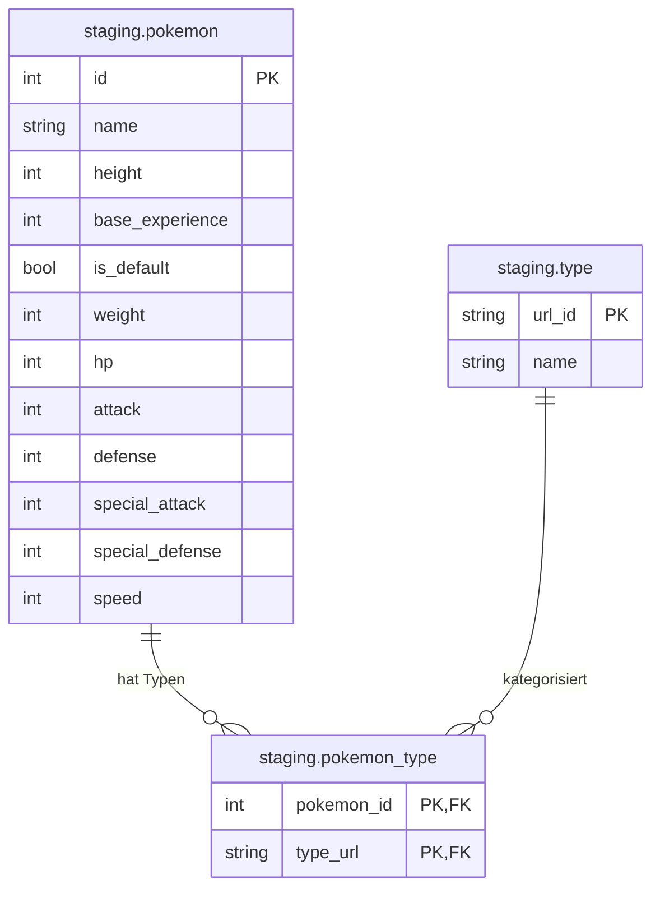
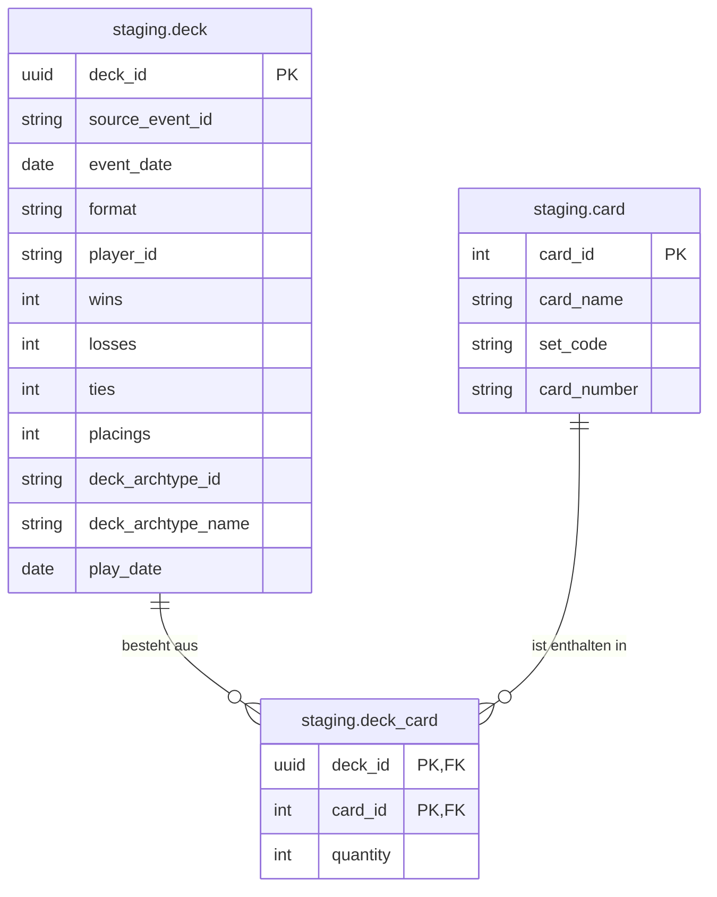
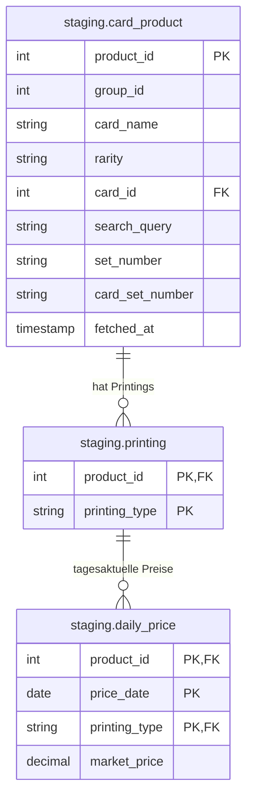

Alle Daten, um die gegebenen 3 Fragen zu beantworten, kommen aus unterschiedlichen REST APIs. 

### Die PokeAPI
Die wichtigste davon ist die PokiAPI, welche Daten zu allen Pokemon beinhaltet. Das Pythonskript
iteriert alle Pokemon IDs von 0 bis 2000, bis keine Antwort mehr kommt. Im Fall, dass die Antwort 404 ist, wurde also jedes Pokemon abgefragt. 
Das Layout sieht wie folgt aus:

Es gibt also Pokemon und Typen. Mithilfe von `staging.pokemon_type` wird typ id `stating.type.url_id` mit Pokemon ID `staging.pokemon.id` gemappt. 

### Limitless API
Limitless ist eine Webseite, auf welcher Pokemon Turniere (online) stattfinden. Jedes der Turniere ist per API abfragbar. 
An einem Turnier können mehrere Spieler teilnehmen, wobei jeder Spieler ein Deck besitzt. Dieses Deck ist dem Turnier 1:1 
zuortenbar. Eine Deck Entität ist genau einem Turnier zuortenbar. Ein Turnier kann - und wird - mehrere Decks besitzen. Die 
Kardinalität ist also n:1. Falls ein Deck mit den Karten A, B und C in mehreren Tournieren vorkommnt, heißt das also, dass dieses
Deck in Form von mehreren Entitäten/Reihen/Tupeln in der Datenbank vorkommt. Aufgrund dessen, dass jedes Deck genau zu einem Turnier
gehört, hängen an dem Deck die Attribute `wins`, `losses` und `ties`. Das sind die für unsere kompetetiv gerichteten Fragen die wichtigsten Daten.  

#### Zur weiteren Struktur:
Neben dem Deck `staging.deck`, gibt es auch Karten (`staging.card`). Wir haben die Daten der letzten 2 Jahre abefragt, woraus herforgeht, dass in etwa 2600 unterschiedliche
Karten gespielt wurden.
Das Mapping, welche Karten in einem Deck sind, finden in `staging.deck_card` statt. 
Insgesamt gibt es 6 Millionen Verknüpfungen von Karte zu Deck, was Abfragen eher langsam macht. In in Fragen, welche sich nach der Stärke einer Karte richten, 
muss also geschaut werden:
- in welchen Decks kommt die Karte vor? (card -> deck_card)
- wie hat das Deck abgeschnitten, also wins, losses und ties (deck_card -> deck). 
Das soll aber nur eine Randbemerkung sein. Aggregationen finden erst im Reporting Layer statt. Ich wollte hier nur schonmal kurz klarstellen,
dass es hier schnell zu Performance Problemen kommen kann.

Das Schema der drei betroffenen Tabellen sieht wie folgt aus:

### Tickermint API
In eine der Fragen ist für uns wichtig, welchen Wert die Karten haben. Dafür nutzen wir Tickermint. Ich würde es beschreiben als die Börse für
Pokemon Karten. Durch die Tickermint-API kann für jede Karte zu jedem Datum der Preis abgefragt werden. Hier gibt es jedoch eine Herausforderung: 
Die Tickermint Karten - und Namen - sind andere, als die der Limitless API. Wärend Limitless Karten keine echten Karten beschreibt, sondern nur 
die digitale Version für die Art Online-Spiel, welches es dort wohl gibt, beschreibt Tickermint tatsächlich physische, echte Karten. 
Für echte Karten, und somit der Tickermit API ist wichtig zu beachten, dass es mehrere Printings gibt. Ein Printing beschreibt im Prinzip, ob 
die Karte glitzert, und falls ja, dann in welcher Art (holo, reverse_holo, einiges anderes) es glitzert. Ebenso kann die Karte auch einfach `common`
sein, also eine normale, nicht glitzernde Variante. Ebenso gehört jede Karte zu einem Set und gehört somit zu einem spezifischen Jahr. 
Das Pokemon einer Karte kann also in meheren Sets vorkommen. Eine Pikachu Karte gibt es also nicht nur einmal. 

#### Zur API Abfrage
Die API benötigt den Name der Karte. Die Antwort ist eine Liste von Ergebnissen. Da es auch bei Limitless, weshalb auch immer, Informationen
zu Set und nummer im Set gibt, wird zur Abfrage der Tickermit API wurde also jede der 2600 Limitless Karten der Turniere durchgegangen,
und eine Seach-Query im Format: `<Karten Name> <Set>/<Nr im Set>` an Tickermint gesendet. Wenn es ein Ergnis gab - oder auch mehere weil mehere Printings - wurde es gespeichert. Gegenüber dazu, wie Staging eigentlich funktioniert, haben wir uns hier dafür entschieden, an der Tickermint Karte in `card_product` die Limitless Karte zuzuordnen, aus welcher die Search-Query
erstellt wurde (`card_product.card_id`). Andernfalls wäre das Mapping im Core-Layer wirklich sinnloser Aufwand, welche Karten von Limitless mit welchen von Tickermint "verwand" sind. Das Problem, dass es dennoch gibt, ist, dass es oft vorkommt, dass
einer Limitless Karte mehrere Tickermint Karten zugeordnet werden. 

Zu jeder der gefetchten Karten werden anschließend die Preise runtergeladen. Grundlegend gibt es zu jeder Karte pro Tag einen 
Preis. Zumindest sehen die Antworten der API stark danach aus. Da der Preis nicht nur von der Karte sondern auch vom 
Printing Typen abhängig ist, hängen an der `daily_price` Relation sowohl `product_id` (die Karten ID von Tickermint) und
`printing_type`.

Das Schema der drei betroffenen Tabellen sieht wie folgt aus:

