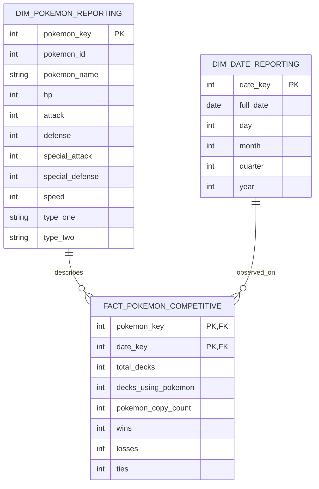
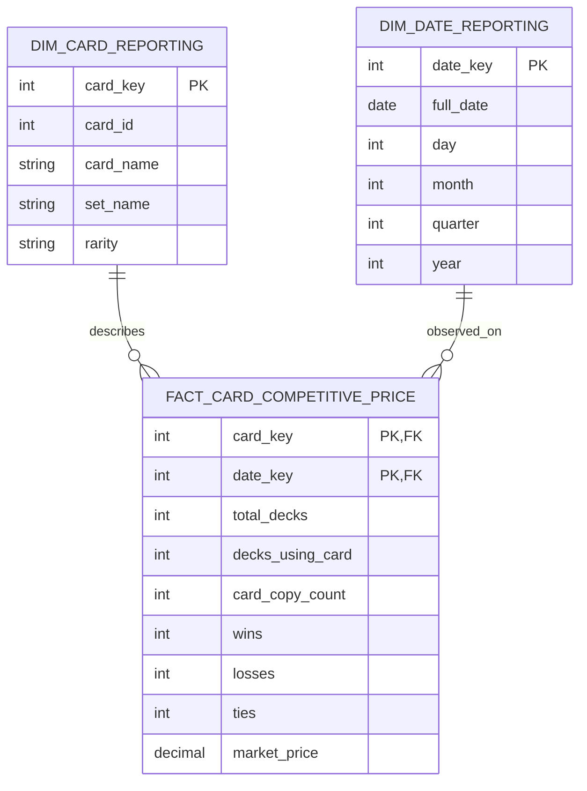
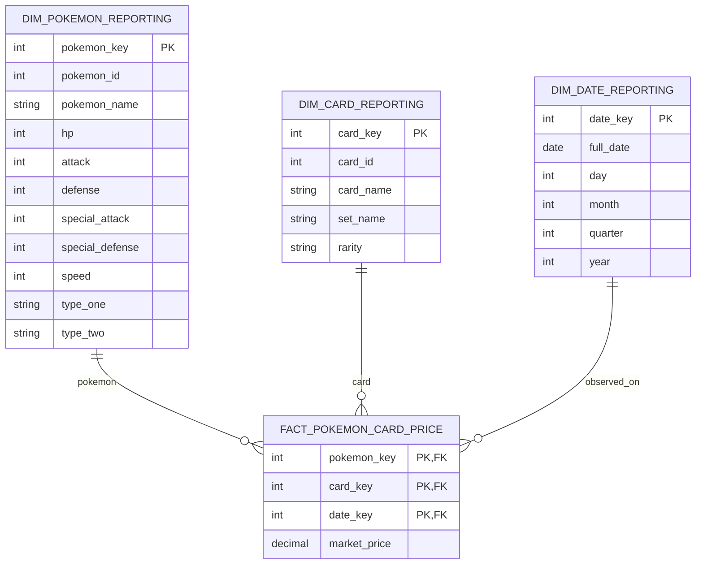
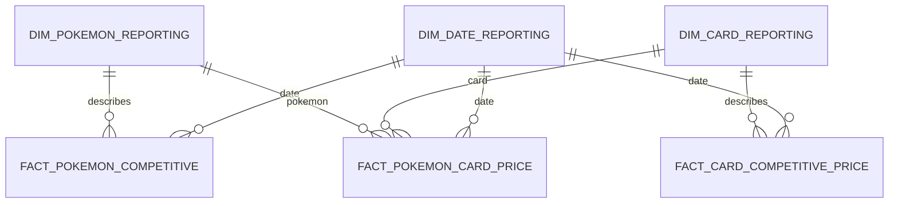

# 1. Starschema: Base stats vs. competitive performance

Grain: Ein Pokemon x ein Tag
```text
FACT_POKEMON_COMPETITIVE
--------------------------------
pokemon_key         PK, FK
date_key            PK, FK

total_decks
decks_using_pokemon
pokemon_copy_count

wins
losses
ties
```

Bedeutung der Fakten:

- `total_decks`:
  Anzahl aller beobachteten Decks zum gegebenen Datum: COUNT(DISTINCT CORE_DECK_RESULT.deck_id)
- `decks_using_pokemon`:
  Anzahl aller Decks, die mindestens eine Karte beinhalten die zu einem Pokemon gemapped wurde: COUNT(DISTINCT TOPIC_BASE_STATS_VS_COMPETITIVE.deck_id)
- `pokemon_copy_count`:
  Anzahl von Kartenkopien, die zu einem Pokemon gehören: SUM(pokemon_copy_count)
- `wins`, `losses`, `ties`:
  SUM(CORE_DECK_RESULT.wins)
  SUM(CORE_DECK_RESULT.losses)
  SUM(CORE_DECK_RESULT.ties)
- `usage_rate`:
  usage_rate = decks_using_pokemon / total_decks
- `win_rate`:
  win_rate = wins / (wins + losses + ties)

Dimensionen:

```text
DIM_POKEMON_REPORTING
--------------------------------
pokemon_key          PK   ← surrogate key
pokemon_id                ← Core/PokeAPI ID
pokemon_name
hp
attack
defense
special_attack
special_defense
speed
type_one
type_two

mit base_stat_total = hp + attack + defense + special_attack + special_defense + speed

DIM_DATE_REPORTING
--------------------------------
date_key        PK
date_id
full_date
day
month
quarter
year
```

star_schema_mermaid:



2. Starschema: Card price vs. competitive performance

Grain: Eine Karte x ein Tag

```text
FACT_CARD_COMPETITIVE_PRICE
--------------------------------
card_key             PK, FK
date_key             PK, FK

total_decks
decks_using_card
card_copy_count

wins
losses
ties

market_price
```

Bedeutung der Fakten:
- `total_decks`:
  Anzahl aller beobachteten Decks zum gegebenen Datum: COUNT(DISTINCT CORE_DECK_RESULT.deck_id)
- `decks_using_card`:
  COUNT(DISTINCT TOPIC_CARD_COMPETITIVE.deck_id)
- `pokemon_copy_count`:
  Anzahl von Kartenkopien, die zu einem Pokemon gehören: SUM(pokemon_copy_count)
- `wins`/`losses`/`ties`:
  Join über deck_id und summieren.
- `market_price`:
  market_price = AVG(market_price across printings)

Name | Printing | Date | Price
--|--|--|--
 Charizard ex | Normal       | 01.09 | 5.00
  Charizard ex | Holofoil     | 01.09 | 8.00
  Charizard ex | Reverse Holo | 01.09 | 9.50

  muss zu einem Wert für Charizard ex zusammengefasst werden: Hierzu wird der Durschnitt, das Minimum und das Maximum gebildet.

Dimensionen:
```text
DIM_CARD_REPORTING
--------------------------------
card_key               PK
card_id
card_name
set_name
rarity

DIM_DATE_REPORTING
--------------------------------
date_key        PK
date_id
full_date
day
month
quarter
year
```

Starschema mermaid:


Aus den Fakten in Kombination mit der Datumsdimension können hier die Kennzahlen

`usage_rate`, 
`win_rate`

`average_copies_when_used`

`average_month_price`, 
`month_end_price`

`price_change_1_month`,
`price_change_3_months`,
`price_change_12_months`

ermittelt werden.


3. Starschema: Pokémon base stats vs. card prices

Grain: Ein Pokemon x eine Karte x ein Tag
```text
FACT_POKEMON_CARD_PRICE
--------------------------------
pokemon_key       PK, FK
card_key          PK, FK
date_key          PK, FK

market_price
```
Auch hier soll der Preis über die verschiedenen printings zusammengefasst werden. (wie bei 2.)


Dimensionen:
```text
DIM_CARD_REPORTING
--------------------------------
card_key               PK
card_id
card_name
set_name
rarity

DIM_DATE_REPORTING
--------------------------------
date_key        PK
date_id
full_date
day
month
quarter
year

DIM_POKEMON_REPORTING
--------------------------------
pokemon_key          PK   ← surrogate key
pokemon_id                ← Core/PokeAPI ID
pokemon_name
hp
attack
defense
special_attack
special_defense
speed
type_one
type_two
```

Starschema mermaid:




Schema Kombination der 3 "Sterne" mit Wiederverwendung der Dimensionen:


### Wie erhält man die Felder für das Reporting aus dem Core?

Für Analyseszenario 1:

| Reporting fact | Derived from Core |
|---|---|
| `FACT_POKEMON_COMPETITIVE.pokemon_key` | `TOPIC_BASE_STATS_VS_COMPETITIVE.pokemon_id --> DIM_POKEMON_REPORTING` |
| `date_key` | `TOPIC...deck_id --> CORE_DECK_RESULT.date_id --> DIM_DATE_REPORTING` |
| `decks_using_pokemon` | `COUNT(DISTINCT deck_id)` |
| `pokemon_copy_count` | `SUM(pokemon_copy_count)` |
| `wins/losses/ties` | join on `deck_id`, then `SUM()` |
| `total_decks` | `COUNT(DISTINCT CORE_DECK_RESULT.deck_id)` per date |

Für Analyseszenario 2:

| Reporting fact | Derived from Core |
|---|---|
| `card_key` | `TOPIC_CARD_COMPETITIVE.card_id --> DIM_CARD_REPORTING` |
| `date_key` | through `CORE_DECK_RESULT.date_id` |
| `decks_using_card` | `COUNT(DISTINCT deck_id)` |
| `card_copy_count` | `SUM(card_copy_count)` |
| `wins/losses/ties` | join on `deck_id`, then `SUM()` |
| `total_decks` | all Core decks on that date |
| `market_price` | `CORE_CARD_PRICE`, reduced to one value per `card_id + date_id` |

Für Analyseszenario 3:

| Reporting fact | Derived from Core |
|---|---|
| `pokemon_key` | `TOPIC_POKEMON_PRICE.pokemon_id` |
| `card_key` | `TOPIC_POKEMON_PRICE.card_id` |
| `date_key` | `CORE_CARD_PRICE.date_id` |
| `market_price` | `CORE_CARD_PRICE.market_price`, after printing aggregation |
